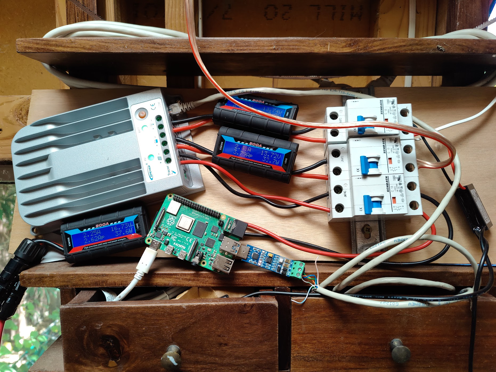

# epsolar-exporter
A prometheus exporter based on https://github.com/Salamek/epsolar-tracer

Uses poetry as the package manager for this python based project.
Available as service, manual execution or through docker.



## use as a systemd service

run `install.sh` to run as a service

## use as docker service
https://hub.docker.com/repository/docker/blackliner/epsolar-exporter
Take the prebuilt image or build and run the dockerfile. Make sure the port 8000 is exposed.

```
docker run --rm -p 8000:8000 blackliner/epsolar-exporter:latest

docker build . -t epsolar_exporter
docker run --rm -it -p 8000:8000 epsolar_exporter
```

## how to choose the TTY port

use the env variable `EPSOLAR_TTY_PORT` to define the tty port, for example:

```
docker run --rm -it --device /dev/ttyUSB1 -p 8000:8000 blackliner/epsolar-exporter:latest
```
